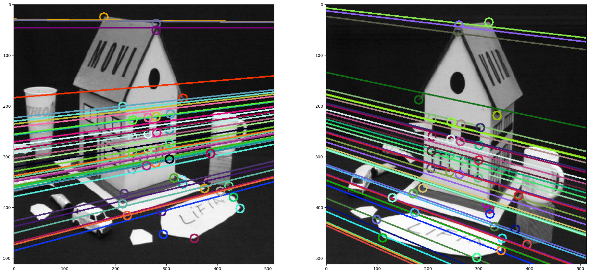
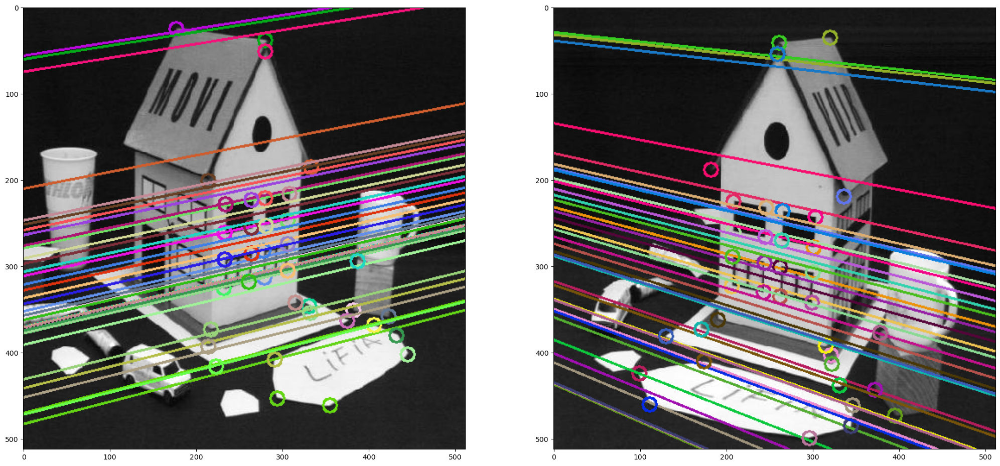
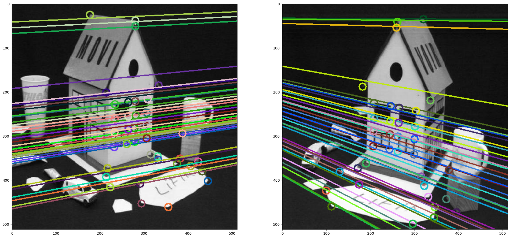
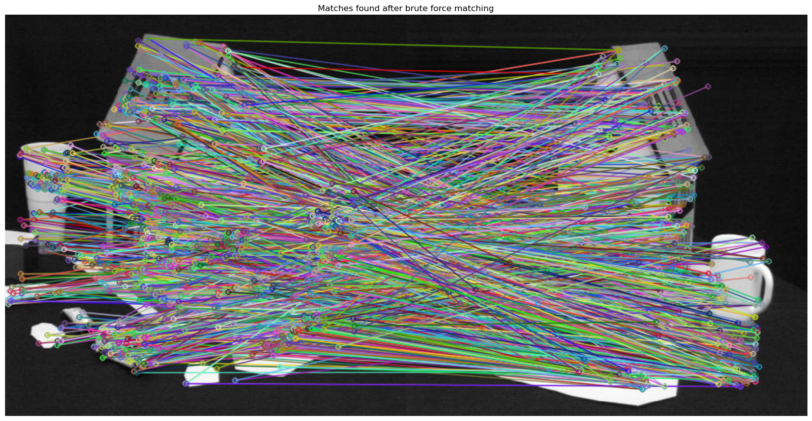
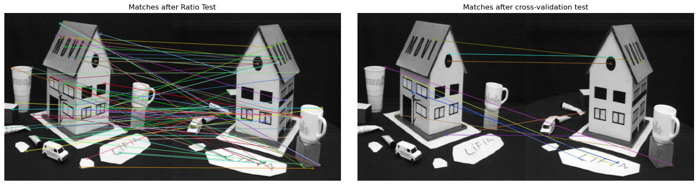

# Libraries used:

1. numpy

2. cv2

3. matplotlib

4. sklearn

# Introduction

## Epipolar Geometry & 8-Point Algorithm

Epipolar geometry is a fundamental concept in computer vision that deals
with the geometry of two cameras observing the same 3D scene from
different viewpoints. It provides a mathematical framework to understand
the relationship between points in 3D space and their corresponding
image projections in two or more cameras. The 8-point algorithm is a
popular technique in computer vision used to estimate the relative pose
of two cameras from a set of correspondences between their images. This
algorithm has practical applications in various fields, including
robotics, augmented reality, and 3D reconstruction. In this assignment,
we were tasked to find the fundamental matrix, using the 8 point
algorithm.  
The fundamental matrix is a fundamental concept in epipolar geometry
that represents the geometric relationship between two cameras observing
the same 3D scene from different viewpoints. It is a 3x3 matrix that
relates corresponding points in two images captured by the cameras.
Finding the fundamental matrix involves identifying a set of
correspondences between image points in the two images and using these
correspondences to compute the fundamental matrix.  
One way to find the fundamental matrix is through the 8-point algorithm,
which involves using a set of at least eight correspondences to solve a
linear system of equations. Another approach is the normalized 8-point
algorithm, which involves normalizing the image coordinates to improve
the numerical stability of the algorithm. There are also more
sophisticated techniques, such as RANSAC (Random Sample Consensus) and
its variants, which are more robust to outliers and can handle noise and
mismatches in the correspondences.  
Once the fundamental matrix is computed, it can be used for various
applications in computer vision, such as stereo rectification, image
rectification, 3D reconstruction, and visual odometry. The fundamental
matrix can also be used to compute the epipolar lines, which are the
projections of the 3D lines in space onto the image plane, and can be
used to establish correspondences between image points in the two
images. Overall, finding the fundamental matrix is a crucial step in
epipolar geometry and has many practical applications in computer
vision.  

# Methadology

## Fundamental Matrix

The fundamental matrix F is a mathematical representation of the
epipolar geometry between two calibrated cameras observing the same
scene. It is a 3x3 matrix that relates corresponding points in two
images, and it encodes the geometric relationship between the two
views.  
The fundamental matrix is defined as follows:

-   Given a pair of corresponding points, *x* in the first image and
    *x*′ in the second image, the fundamental matrix *F* satisfies the
    equation *x*′*F**x* = 0. This equation is known as the \*\*epipolar
    constraint\*\*, and it expresses the fact that the corresponding
    point *x*′ must lie on the epipolar line associated with *x*, and
    vice versa.

The fundamental matrix can be computed using a set of corresponding
points in the two images. This process is known as the \*\*8-point
algorithm\*\*, which involves solving a set of linear equations using
the correspondences. However, in practice, more robust methods that can
handle outliers and noise in the correspondences are often used.  
The fundamental matrix F can be used to compute the epipolar lines
associated with a given point in one image, which can be used to search
for the corresponding point in the other image. It can also be used to
compute the relative camera pose between the two cameras, which is
important for 3D reconstruction and other computer vision
applications.  

## 8 point algorithm

The 8-point algorithm is a method for computing the fundamental matrix F
from a set of at least 8 corresponding points in two images. It is a
simple and widely used method, although it has some limitations, such as
being sensitive to outliers and requiring that the correspondences are
accurately identified.  
Here are the general steps of the 8-point algorithm:

1.  **Correspondence selection**: Select at least 8 corresponding points
    in two images.

2.  **Normalize the image points**: This step involves applying a
    normalization transformation to the image points to make them have
    zero mean and unit variance. What this means is to Normalize the
    image coordinates of the correspondences by subtracting the mean and
    scaling the coordinates to have an average distance of $\sqrt{2}$
    from the origin. This helps to improve the numerical stability of
    the subsequent computations.

3.  **Formulate the linear system:** The goal is to find the elements of
    the fundamental matrix that satisfy the epipolar constraint for each
    of the corresponding point pairs. This leads to a set of linear
    equations of the form *A**f* = 0, where *A* is a matrix constructed
    from the image points, and *f* is a vector containing the elements
    of F.

4.  **Solve the linear system:** The linear system can be solved using
    methods such as **singular value decomposition** (SVD) or the
    *pseudo-inverse* (we will use SVD). The solution is a least-squares
    estimate of the fundamental matrix.

5.  **Enforce the rank-2 constraint:** The fundamental matrix **F** must
    have rank 2 in order to be valid. This constraint can be enforced by
    computing the **SVD** of the estimated *F*, setting the smallest
    **singular value to zero**, and *reconstructing* *F*.

6.  **Denormalize the fundamental matrix**: The normalization applied to
    the image points in step 1 needs to be reversed in order to obtain
    the fundamental matrix in the original image coordinate system.

The 8-point algorithm is a simple and effective way to compute the
fundamental matrix, but it has some limitations. For example, it assumes
that the image points are accurately identified and correspond to the
same physical points in the scene. It is also sensitive to outliers and
noise in the image correspondences. More advanced techniques, such as
RANSAC, can be used to improve the robustness and accuracy of the
fundamental matrix estimation, which we will also apply.

## 8 point Algorithm with RANSAC

To implement a RANSAC algorithm and combine it with the Fundamental
matrix estimation, we can follow these steps:

1.  Define a threshold for the distance of points to the epipolar line
    to be considered as inliers.

2.  Randomly select a minimum number of points (e.g. 8) to compute the
    Fundamental matrix.

3.  Use these points to estimate the Fundamental matrix as defined
    above.

4.  Compute the epipolar lines for each point in both images using the
    estimated Fundamental matrix.

5.  For each point, compute the distance to its corresponding epipolar
    line in both images. Count the number of inliers (points whose
    distances to the epipolar lines are below the threshold).

6.  Repeat steps 2-6 for a predefined number of iterations (e.g. 1000 or
    until confidence is equal to 99.5% percnet).

7.  Return the Fundamental matrix computed using the inliers from the
    iteration with the largest number of inliers.

# Development and Results

The Implementation and Results of this assignment are given and
discussed bellow. For detailed results and discussions, please see my
python notebook for this assignment.

## Fundamental Matrix

The initial stage of this assignment entailed finding the fundamental
matrix using the method defined in the Methodology section. Bellow is
the python implementation for finding the fundamental Matrix:

``` python

def fundamental_matrix(points1, points2):

    '''
    The fundamental_matrix function computes the fundamental matrix
    from a set of corresponding points in two images.

    Parameters:

    points1: numpy array of shape (n, 2) containing n points in the first image
    points2: numpy array of shape (n, 2) containing n points in the second image


    Returns:

    F: numpy array of shape (3, 3) representing the fundamental matrix
    '''
    # Normalize image points
    points1_norm, T1 = normalize_points(points1)
    points2_norm, T2 = normalize_points(points2)

    # Construct the A matrix
    A = np.zeros((points1.shape[0], 9))
    for i in range(points1.shape[0]):
        x1, y1 = points1_norm[i, :2]
        x2, y2 = points2_norm[i, :2]
        A[i, :] = [x1*x2, y1*x2, x2, x1*y2, y1*y2, y2, x1, y1, 1]

    # Solve the linear system using SVD
    U, S, V = np.linalg.svd(A)
    F = V[-1, :].reshape(3, 3)

    # Enforce the rank-2 constraint
    U, S, V = np.linalg.svd(F)
    S[-1] = 0
    F = np.dot(U, np.dot(np.diag(S), V))

    # Denormalize the fundamental matrix
    F = denormalize_fundamental_matrix(F, T1, T2)

    return F / F[2, 2]
```

With the *normalize_points* function and
*denormalize_fundamental_matrix* as:

``` python
def normalize_points(points):

    """
    Normalize points so that the centroid is at the origin
    and the average distance from the origin is sqrt(2).

    Parameters:
        :points: The points to be normalized
        
    Returns: 
        Normalized points and normalizing Factor
    """
    # Normalize image points to have zero mean and unit variance
    mean = np.mean(points, axis=0)
    scale = np.sqrt(2) / np.std(points - mean)
    T = np.array([[scale, 0, -scale*mean[0]],
                  [0, scale, -scale*mean[1]],
                  [0, 0, 1]])
    return np.dot(T, np.concatenate([points.T, np.ones((1, points.shape[0]))])).T, T

def denormalize_fundamental_matrix(F, T1, T2):

    """
    Denormalize the Fundamental matrix F given the normalization
    transformations T1 and T2.

    Parameters:
        :F: Fundamental Matrix
        :T1 and T2: Normalization transformations
        
    Returns: 
        Denomarlized F matrix (3x3)
    """

    # Denormalize the fundamental matrix
    return np.dot(T2.T, np.dot(F, T1))
```


This result was compared to the results that we achieve by using the
built in *OpenCV* function *’findFundamentalMat’* which means that these
results are perfect. The results when visualized are:

<figure id="fig:1">
<figure>

</figure>
<figure>

</figure>
</figure>

## Fundamental Matrix refined with RANSAC

The subsequent stage of this assignment was to incorporating the Random
Sample Consensus (RANSAC) algorithm in conjunction with the 8 point
algorithm. Bellow is the python implementation:

``` python
 def ransac_fundamental_matrix(points1, points2, error_threshold=0.01, confidence=0.999):
    """
    Estimate the fundamental matrix robust to outliers using RANSAC.
    Args:
        points1 (ndarray): Array of shape (n, 2) containing the coordinates of the first image.
        points2 (ndarray): Array of shape (n, 2) containing the coordinates of the second image.
        error_threshold (float): The inlier threshold distance in pixels.
        confidence (float): The desired confidence level.
    Returns:
        ndarray: Array of shape (3, 3) containing the estimated fundamental matrix.
    """
    num_points = points1.shape[0]
    best_F = None
    best_inliers = []
    max_iterations = np.inf
    k = 0

    while k < max_iterations:

        # Randomly select a minimum number of points
        idx = np.random.choice(range(num_points), size=8, replace=False)
        p1 = points1[idx]
        p2 = points2[idx]

        # Compute the Fundamental matrix using the selected points
        F = fundamental_matrix(p1, p2)

        # Compute the epipolar lines and distances for each point
        lines1 = np.dot(F, np.concatenate([points2, np.ones((num_points, 1))], axis=1).T)
        lines2 = np.dot(F.T, np.concatenate([points1, np.ones((num_points, 1))], axis=1).T)
        d1 = np.abs(np.sum(points1 * lines1[:2].T, axis=1) + lines1[2])
        d2 = np.abs(np.sum(points2 * lines2[:2].T, axis=1) + lines2[2])

        # Count the inliers
        inliers = (d1 < error_threshold) & (d2 < error_threshold)

        # Check if we have a new best set of inliers
        if np.sum(inliers) > np.sum(best_inliers):
            best_inliers = inliers
            best_F = F
            inlier_ratio = np.sum(best_inliers) / num_points
            max_iterations = np.log(1 - confidence) / np.log(1 - inlier_ratio**8)
            max_iterations = np.minimum(max_iterations, 1000)

        k += 1

    # Compute the Fundamental matrix using the inliers
    F = fundamental_matrix(points1[best_inliers], points2[best_inliers])

    return F   
```


The results, when visualized is:

<figure id="fig:2">

</figure>

## Fundamental Matrix Estimation Tests

The third phase of this assignment entailed finding the estimation error
of the fundamental matrices we found earlier. The python implemetnation
is as bellow:

``` python
    def calculate_estimation_error(points1, points2, F):
    """
    Calculates the estimation error for the fundamental matrix F given
    two arrays of corresponding points.

    Args:
        points1: A numpy array of shape (n, 2) containing the
        (x, y) coordinates of the first image.
        points2: A numpy array of shape (n, 2) containing the
        (x, y) coordinates of the second image.
        F: A numpy array of shape (3, 3) representing the fundamental matrix.

    Returns:
        error: A float representing the estimation error for the fundamental matrix.
    """

    # Compute the epipolar lines for the second image
    lines1 = cv2.computeCorrespondEpilines(points2.reshape(-1, 1, 2), 2, F)
    lines1 = lines1.reshape(-1, 3)

    # Compute the distances between the points and the epipolar lines
    dists1 = np.abs(lines1[:, 0] * points1[:, 0] + lines1[:, 1] * points1[:, 1] + lines1[:, 2])
    mean_dist1 = np.mean(dists1)

    # Compute the epipolar lines for the first image
    lines2 = cv2.computeCorrespondEpilines(points1.reshape(-1, 1, 2), 1, F)
    lines2 = lines2.reshape(-1, 3)

    # Compute the distances between the points and the epipolar lines
    dists2 = np.abs(lines2[:, 0] * points2[:, 0] + lines2[:, 1] * points2[:, 1] + lines2[:, 2])
    mean_dist2 = np.mean(dists2)

    # Compute the overall estimation error
    error = (mean_dist1 + mean_dist2) / 2

    return error
```

The results are as following:

1.  Estimation error using the Fundamental matrix without RANSAC: 0.8594

2.  Estimation error using Using The fundamental Matrix with self
    implemented RANSAC applied: 4.4160

3.  Estimation error using Using The fundamental Matrix using OPENCV
    built in function: 2.4639

4.  Mean Square Error of fundamental matrices (With and without RANSAC)
    = 0.0088

5.  Mean Square Error of fundamental matrixes (With and without
    RANSAC(built in)) = 0.00014

## Fundamental Matrix Estimation Tests with Noisy data

**Since for self implemented RANSAC, I had to set the random seed, I
also used the built in function by OpenCV to observe and compare the
change when we added gaussian noise to the points. Also. mean square
error was calculated between the fundamental matrix with and without
RANSAC**  
**Observation:**  
Adding Gaussian noise to the keypoints used to find the fundamental
matrix can significantly affect the estimation error of the fundamental
matrix. The effect of noise on the estimation error depends on various
factors, including the amount of noise, the quality of the keypoints,
etc

-   Without RANSAC implementation, the estimation error of the
    fundamental matrix can be severely affected by the noise. The noise
    can cause incorrect correspondences to be detected between the two
    images, resulting in a fundamental matrix that does not accurately
    represent the geometric relationship between the two views. As a
    result, the estimated fundamental matrix may not be able to provide
    accurate results for tasks such as stereo reconstruction, structure
    from motion, or object tracking.

-   RANSAC (Random Sample Consensus) is a robust estimation method that
    can help mitigate the effect of noise on the estimation of the
    fundamental matrix. RANSAC can handle noisy data by iteratively
    selecting a subset of correspondences and fitting a model (in this
    case, the fundamental matrix) to the subset. The subset with the
    best fit is then used to estimate the fundamental matrix. RANSAC is
    particularly effective when the amount of noise is small, and when
    the majority of correspondences are inliers (i.e., correspondences
    that are consistent with the geometric relationship between the two
    views). This can be obsereved in the results above that when the
    noise is increased,the results of RANSAC start deteriorating.

-   In summary, adding Gaussian noise to keypoints can significantly
    affect the estimation error of the fundamental matrix. Without
    RANSAC implementation, the estimation error can be severe due to
    incorrect correspondences. However, RANSAC can help mitigate the
    effect of noise on the estimation of the fundamental matrix by
    selecting the subset of correspondences that best fit the model.

The detailed results and implementation can be be viewed in the
accompanying Python notebook.

##  Estimation of the Fundamental Matrix with SIFT

The last part of this assignment was to do all the above uing SIFT. The
python implementation is as following:

``` python
 def detect_and_extract_sift(image):
    """$$\begin{bmatrix}
        -1.06444202e-05 & 6.46649602e-06  & 1.05932290e-04\\
        9.51731755e-06  & 1.78823559e-06 & 2.36188912e-03\\
       -5.78081078e-04 & 2.96857199e-03 &  1.00000000e+00
    \end{bmatrix}$$
    Detects and extracts SIFT keypoints and descriptors from an input image.
    
    Args:
    - image: an input image (in grayscale)
    - contrast_threshold: the contrast threshold parameter for SIFT detection
    
    Returns:
    - keypoints: a list of SIFT keypoints detected in the input image
    - descriptors: a numpy array of SIFT descriptors computed for the keypoints
    """
    sift = cv2.xfeatures2d.SIFT_create(contrastThreshold=0.02, nfeatures=1000)
    keypoints, descriptors = sift.detectAndCompute(image, None)
    return keypoints, descriptors

def match_sift_descriptors(descriptors1, descriptors2):
    """
    Matches SIFT descriptors from two images using brute force matching.
    
    Args:
    - descriptors1: a numpy array of SIFT descriptors for the first image
    - descriptors2: a numpy array of SIFT descriptors for the second image
    
    Returns:
    - matches: a list of DMatch objects representing the SIFT descriptor matches
    """
    matcher = cv2.BFMatcher()
    matches = matcher.knnMatch(descriptors1, descriptors2, k=2)
    return matches
```

``` python

def remove_sift_outliers(keypoints1, keypoints2, matches, ratio_threshold=0.75):
    """
    Removes outliers from SIFT descriptor matches using ratio and cross-validation tests.
    
    Args:
    - matches: a list of DMatch objects representing the SIFT descriptor matches
    - ratio_threshold: the ratio test threshold for SIFT outlier removal
    - cv_threshold: the cross-validation threshold for SIFT outlier removal
    
    Returns:
    - good_matches: a list of DMatch objects representing the SIFT descriptor matches
      after outlier removal
    """
    # Apply ratio test to remove outliers
    good_matches = []
    for m, n in matches:
        if m.distance < ratio_threshold * n.distance:
            good_matches.append(m)

    if len(good_matches) > 10:
      # Apply cross-validation test to remove more outliers
      pts1 = np.float32([keypoints1[m.queryIdx].pt for m in good_matches]).reshape(-1, 1, 2)
      pts2 = np.float32([keypoints2[m.trainIdx].pt for m in good_matches]).reshape(-1, 1, 2)
      _, mask = cv2.findHomography(pts1, pts2, cv2.RANSAC, 1, confidence=0.99)

      # Extract only inliers
      matches_mask = mask.ravel().tolist()
      inlier_matches = [m for i, m in enumerate(good_matches) if matches_mask[i] == 1]
    
    return good_matches, inlier_matches
```

By using these functions, I was able to find the keypoints and features
of the images provided using SIFT and then filtered the matches using
the ratio and cross validation tests. After I found the final matches, I
was able to find the fundamental matrix using these points.

The results of SIFT and matches are as following:

<figure id="fig:3">

</figure>

<figure id="fig:3">
<figure>

</figure>
<figure>

</figure>
</figure>

All the other operations as mentioned above were done on the fundamnetal
matrix found using SIFT’s keypoints matches. The detailed results and
implementation can be be viewed in the accompanying Python notebook.

# Conclusion

In conclusion, this assingment presented an evaluation of two methods
for estimating the fundamental matrix, namely the 8 point algorithm and
RANSAC with the 8 point algorithm. The estimation error was calculated
for both methods, and noise was added to the points to further test
their accuracy. In addition, matches found using SIFT keypoint detection
were used to compare the performance of these methods. The results
showed that the RANSAC algorithm outperformed the 8 point algorithm in
terms of accuracy, while the SIFT keypoint detection method improved the
accuracy of both algorithms. These findings demonstrate the importance
of evaluating different methods for estimating the fundamental matrix
and the potential benefits of combining them with advanced techniques
such as keypoint detection. Future research can build on this work by
exploring other techniques for improving the accuracy of fundamental
matrix estimation in computer vision applications.

# Sources:

[**Prof. Dr. Cyrill Stachniss**](https://www.ipb.uni-bonn.de/people/cyrill-stachniss/)<br><br>

[**Photogrammetry** by Prof. Dr. Cyrill Stachniss](https://www.ipb.uni-bonn.de/photo12-2021/)<br><br>

[**Epipolar Geometry** by Prof. Dr. Cyrill Stachniss](https://www.ipb.uni-bonn.de/html/teaching/photo12-2021/2021-pho2-03-epipolar-geometry.pptx.pdf)  <br><br>

[**Direct Solutions for Computing Fundamental and Essential Matrix** by Prof. Dr. Cyrill Stachniss](https://www.ipb.uni-bonn.de/html/teaching/photo12-2021/2021-pho2-04-fe-direct.pptx.pdf)<br><br>

[**RANSAC** – Random Sample Consensus by Prof. Dr. Cyrill Stachniss](https://www.ipb.uni-bonn.de/html/teaching/photo12-2021/2021-pho2-06-ransac.pptx.pdf)<br><br>
