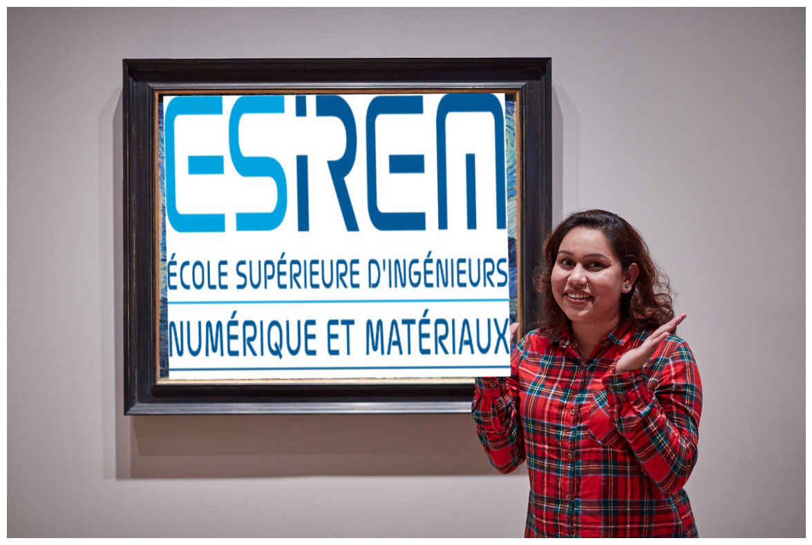
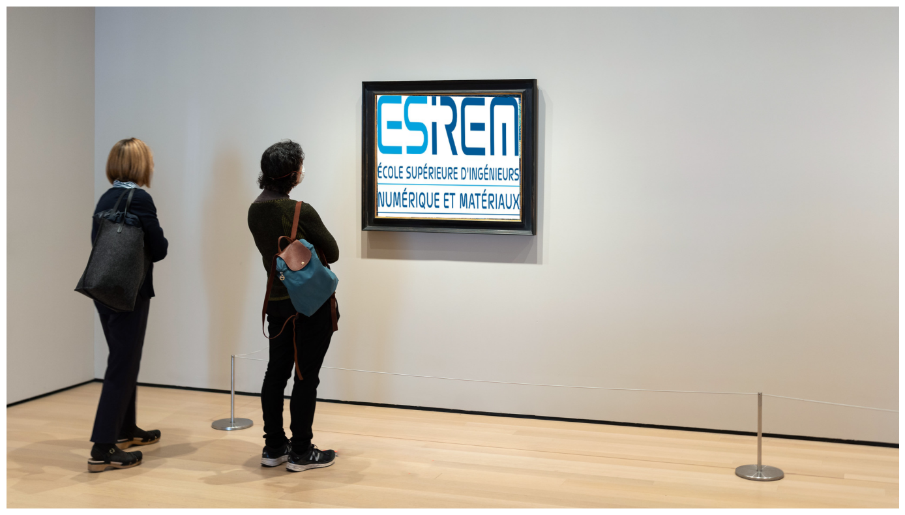
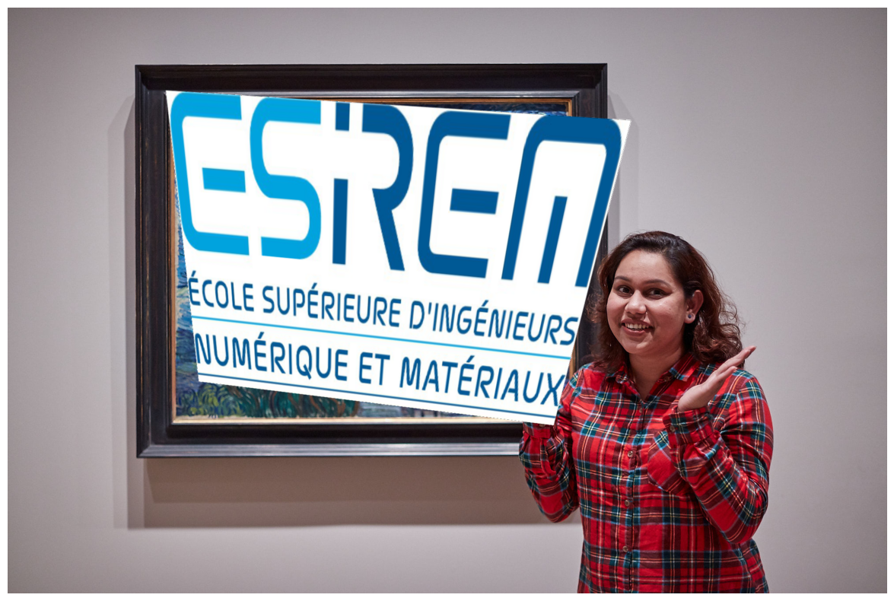
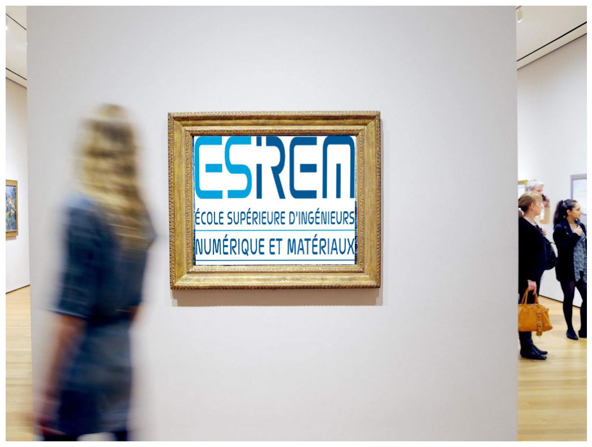
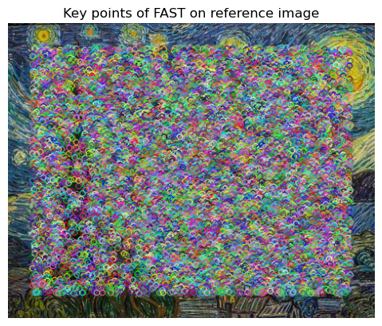
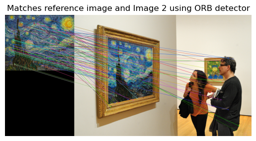

# Introduction

## Object Recognition & Augmented Reality with Homographies

Object recognition is the ability of a computer or an intelligent system
to identify and categorize objects in digital images or videos. It
involves analyzing the characteristics of an object, such as its shape,
size, texture, and color, and matching them with known objects in a
database.  

Object recognition has numerous practical applications, such as in
robotics, surveillance, autonomous vehicles, medical imaging, and
augmented reality. It has also contributed to the development of other
technologies, such as facial recognition and image search engines.  
In this assignment, we were tasked to match the painting ’The Starry
Night’ by Vincent van Gogh in four images and replace the painting with
the logo of ESIREM.  

Object recognition using SIFT and brute force matching is a computer
vision technique that involves detecting and matching SIFT
(Scale-Invariant Feature Transform) descriptors in images to identify
and locate objects.  

SIFT is a feature detection algorithm that identifies key points or
features in an image that are invariant to scale, rotation, and
illumination changes. These features are described using a
128-dimensional vector of values that represent the gradient orientation
and magnitude at each pixel.  

To recognize an object using SIFT and brute force matching, the
following steps are taken:

1.  Extract SIFT descriptors: The SIFT algorithm is applied to both the
    reference image (which contains the object to be recognized) and the
    query image (which may contain the object or a similar object). This
    step involves detecting the key points in each image and computing
    the SIFT descriptors for each key point.

2.  Match SIFT descriptors: The SIFT descriptors in the reference image
    are compared with those in the query image using a brute force
    matching approach. For each descriptor in the reference image, the
    closest descriptor in the query image is identified based on the
    Euclidean distance between their respective vectors.

3.  Filter matches: To reduce false matches, a ratio test is performed
    on the distances between the two closest descriptors in the query
    image. If the ratio of the distances is below a certain threshold,
    the match is considered valid.

4.  Compute homography: Once a sufficient number of matches have been
    found, a homography matrix is computed, either using DLT or RANSAC
    or by using them together. The homography matrix describes the
    geometric transformation between the reference image and the query
    image.

5.  Warp image: The query image is warped using the homography matrix to
    align it with the reference image.

Object recognition using SIFT and brute force matching has been widely
used in computer vision applications such as robotics, augmented
reality, and surveillance. However, it may not be as efficient as more
recent techniques such as deep learning-based object recognition
algorithms, which can handle larger datasets and are more robust to
variations in lighting and viewpoint.

# Methodology

## SIFT - Scale-Invariant Feature Transform

SIFT (Scale-Invariant Feature Transform) is a computer vision algorithm
that is used for detecting and describing local features in images. SIFT
is widely used in computer vision applications such as object
recognition, image stitching, and image retrieval.  
The steps involved in the SIFT algorithm are as follows:

1.  **Scale-space extrema detection**: The first step in the SIFT
    algorithm is to detect the scale-space extrema (i.e., the points of
    maximum or minimum in the scale-space image pyramid) at different
    scales and orientations. This is done by convolving the input image
    with a Gaussian kernel at different scales and applying a
    difference-of-Gaussian filter to detect the local extrema.

2.  **Keypoint localization**: After detecting the extrema, the next
    step is to localize the keypoints by fitting a model to the detected
    points. This involves computing the location, scale, and orientation
    of the keypoints by fitting a quadratic function to the extrema in
    the scale-space image pyramid.

3.  **Orientation assignment:** Once the keypoints are localized, the
    next step is to assign an orientation to each keypoint. This is done
    by computing the gradient magnitude and orientation at each point in
    a neighborhood around the keypoint and constructing a histogram of
    orientations. The dominant orientation in the histogram is used as
    the orientation of the keypoint.

4.  **Keypoint descriptor**: After assigning an orientation to each
    keypoint, the next step is to construct a descriptor for each
    keypoint that is invariant to scale and rotation. This involves
    computing a set of orientation histograms for a number of different
    subregions around the keypoint, and concatenating them into a single
    feature vector.

5.  **Keypoint matching**: The final step is to match the keypoints
    between different images. This is done by comparing the descriptors
    of the keypoints in each image and finding the closest match using a
    distance metric such as Euclidean distance or Hamming distance.

## Brute Force Matching (One to all)

Brute force matching is a technique used in computer vision to find the
closest match between two sets of features by comparing every feature in
one set to every feature in the other set. In the case of one-to-all
matching, one set of features (e.g., the features in the reference
image) is compared to another set of features (e.g., the features in
another image conataining the refrence image).  

The steps involved in brute force matching (one-to-all) are as follows:

1.  **Feature detection**: The first step is to detect the features in
    the reference image using a feature detection algorithm such as
    SIFT. These features are typically keypoint locations and
    descriptors that describe the local appearance of the image.

2.  **Feature matching**: Next, the features in the input reference are
    matched to the features in the second image containing the reference
    image using a distance metric such as Euclidean distance. For each
    feature in the reference image, the distance to every feature in the
    other image is computed, and the feature in the other image with the
    closest distance is considered the best match.

3.  **Match filtering**: After computing the matches between the input
    image and the database, the matches are filtered to remove false
    positives and improve the accuracy of the matching. For this, we use
    the 1NN/2NN Ratio test.

## Homography

Homography is a mathematical transformation that describes the
relationship between two images of the same scene viewed from different
perspectives or angles. In computer vision, homography is used to warp
or transform one image into the perspective of another image, a process
known as image wrapping or image rectification.  

The homography transformation can be represented by a 3x3 matrix that
maps the coordinates of one image to the corresponding coordinates in
the other image. Given a set of corresponding points in two images, the
homography matrix can be computed using various techniques such as
Direct Linear Transform (DLT) or RANSAC.  

Once the homography matrix is computed, it can be used to warp or
transform one image into the perspective of the other image. This is
done by mapping the coordinates of each pixel in the first image to the
corresponding coordinates in the second image using the homography
matrix. The resulting transformed image will appear as if it was taken
from the same perspective as the second image.  

## Normalized Direct Linear Transform (DLT)

Normalized Direct Linear Transform (DLT) is a method for computing the
homography matrix from a set of corresponding points in two images. It
is a variation of the standard DLT algorithm that improves the numerical
stability and accuracy of the homography matrix by normalizing the input
data.  

The steps involved in the normalized DLT algorithm for homography are as
follows:

1.  **Data normalization**: The first step is to normalize the input
    data to improve the numerical stability and accuracy of the
    computation. This is done by translating and scaling the
    corresponding points in both images so that they have zero mean and
    unit variance. The normalization parameters are stored for later use
    in denormalizing the homography matrix.

2.  **Homogeneous coordinates**: Next, the corresponding points in both
    images are converted to homogeneous coordinates by adding a third
    coordinate with a value of 1. This is done to allow the points to be
    transformed by a 3x3 matrix, which is the format of the homography
    matrix.

3.  **Linear system**: The homogeneous coordinates of the corresponding
    points are used to set up a linear system of equations that can be
    solved for the elements of the homography matrix. The linear system
    is set up by stacking the equations for each pair of corresponding
    points into a matrix equation.

4.  **SVD decomposition**: The linear system is solved using Singular
    Value Decomposition (SVD), which is a numerical method for finding
    the eigenvalues and eigenvectors of a matrix. The SVD decomposition
    allows for the solution of the linear system and the computation of
    the homography matrix.

5.  **Denormalization**: After the homography matrix is computed, it is
    denormalized using the normalization parameters that were stored in
    step 1. This is done to convert the homography matrix back to the
    original coordinate system of the input data.

## RANSAC – Random Sample Consensus

RANSAC (Random Sample Consensus) is a robust estimation algorithm that
is used to find the best model that fits a set of observed data points
that may contain outliers. It is commonly used in computer vision
applications such as image registration, stereo vision, and object
recognition.  

The steps involved in the RANSAC algorithm are as follows:

1.  **Random sampling**: The first step is to randomly select a subset
    of the observed data points to form an initial sample set. The size
    of the sample set is determined by the minimum number of points
    required to fit the model.

2.  **Model fitting**: Next, a model is fit to the sample set using a
    standard fitting algorithm such as least-squares regression or
    maximum likelihood estimation.

3.  **Consensus set determination**: The next step is to determine the
    consensus set of data points that are consistent with the model.
    This is done by finding the set of data points that are within a
    certain distance threshold of the model.

4.  **Model evaluation**: After finding the consensus set, the quality
    of the model is evaluated by computing a measure of goodness-of-fit,
    such as the number of inliers in the consensus set or the residual
    error of the model.

5.  **Model refinement**: If the quality of the model is above a certain
    threshold, the model is refined by fitting it to the entire
    consensus set. If the quality is below the threshold, the algorithm
    returns to step 1 and selects a new random sample set.

6.  **Iteration termination**: The algorithm terminates after a fixed
    number of iterations or when a sufficiently good model is found.

## DLT with RANSAC

Using RANSAC in conjunction with DLT can improve the accuracy of the
homography matrix estimation by robustly dealing with outliers or
incorrect matches in the correspondence set. The basic steps of DLT with
RANSAC are:

1.  **Random sampling**: Randomly select the minimum number of points
    required to compute a homography matrix. This is typically four
    corresponding points, which are a minimum number of points required
    to uniquely estimate a homography.

2.  **Homography estimation**: Compute a homography matrix using the
    selected set of points using DLT.

3.  **Inlier determination**: Apply the estimated homography matrix to
    all the remaining points in the correspondence set, and determine
    which points are inliers or outliers. Points whose distance is below
    a certain threshold are considered inliers.

4.  **Consensus set determination**: The inliers from step 3 are added
    to a consensus set, and the size of the consensus set is recorded.

5.  **Repeat steps 1-4** many times, and keep track of the homography
    matrix that produces the largest consensus set.

6.  **Homography refinement**: After the iterations of steps 1-5, a
    homography matrix is estimated using the largest consensus set. This
    homography matrix can be refined using all the inliers in the
    correspondence set, using DLT.

7.  **Final inlier determination**: The final inliers are determined
    using the refined homography matrix.

8.  **Final homography estimation**: Finally, the homography matrix is
    estimated using all the inliers from step 7, using DLT.

# FAST and ORB

FAST (Features from Accelerated Segment Test) and ORB (Oriented FAST and
Rotated BRIEF) are both feature detection and description algorithms
used in computer vision and image processing. They are similar to SIFT
(Scale-Invariant Feature Transform) in that they are used to identify
distinctive features in an image, which can then be used to match and
align multiple images.  

The main difference between these algorithms is in the way they detect
and describe features. SIFT detects features by finding the local maxima
and minima of difference-of-Gaussian (DoG) images at multiple scales,
and describes features using histograms of gradient orientations. On the
other hand, FAST is a corner detection algorithm that looks for
locations in an image where the intensity changes rapidly in all
directions, and ORB is a combination of FAST and BRIEF (Binary Robust
Independent Elementary Features), a descriptor that uses binary strings
to describe feature locations.  

Compared to SIFT, FAST and ORB are generally faster and more
computationally efficient, but may be less robust to changes in lighting
and other image transformations. However, they are still widely used in
real-time applications such as robotics and augmented reality, where
speed is an important consideration.  

To accomplish this task, we utilized the Features from Accelerated
Segment Test (FAST) algorithm to extract keypoints, and the Oriented
FAST and Rotated BRIEF (ORB) algorithm to extract descriptors. The
feature matching and Homography estimation procedures were performed
initially using the built-in functions, and subsequently using the
algorithms implemented in the previous phases of this assignment.

# Development and Results

The Implementation and Results are given and discussed in my python notebook for this project. A few of them are as:

## Keypoint Extraction using SIFT

The initial stage of this task entailed the extraction of keypoints from
the reference image and other images through the Scale-Invariant Feature
Transform (SIFT) technique. The OpenCV library was utilized to implement
this process. Moreover, two different approaches were employed to
extract the top 1000 keypoints: manual selection and parameter
adjustment in the SIFT function of OpenCV. The results are as following:

It is noteworthy that there exist dissimilarities between the outcomes
of these two techniques. The approach that entailed altering the
parameter "nfeatures=1000" of the SIFT function enabled the detection of
up to 1000 keypoints in the image, irrespective of their quality.
Conversely, the manual technique employed SIFT without any limitation on
the number of detected keypoints. Subsequently, the detected keypoints
were sorted based on their response, and only the top N keypoints were
selected.

It is also pertinent to note that the Binary Robust Invariant Scalable
Keypoints (BRISK) approach was considered as an alternative to SIFT.
However, while BRISK offers a valid alternative to SIFT, the latter
remains a preferred option, particularly as it is freely available now.
For a more in-depth discussion on this topic, please refer to the
accompanying Python notebook.

## Finding Matches

The subsequent stage of this task was the identification of matching
features between the descriptors of the reference image and those of the
other images. The brute force technique was implemented for this
purpose.

### Unfiltered Matches

The results of Brute force matching are as bellow:

The results obtained from the brute force matching technique revealed
numerous ambiguous matches, which can be viewed in the accompanying
Python notebook.

### Filtered Matches

To address this challenge, we conducted a 1NN/2NN ratio test, which
involved filtering the matches to eliminate any ambiguous ones.

The outcomes of this process demonstrated a substantial reduction in the
number of ambiguous matches, and the results were similar to those
obtained from the built-in OpenCV function.

## Homography using DLT

The third phase of this task involved the estimation of the Homography
matrix utilizing the Direct Linear Transformation (DLT) algorithm. The
process was done using two different libraries, namely Numpy (CPU) and
PyTorch (GPU), and the implementation can be viewed in the accompanying
Python notebook.  

The outcomes from using both the libraries were comparable, only
diffrence was the computational time as GPUs are more faster than
CPUs.  

However, errors were observed in the results owing to the presence of
outliers, which were addressed in the subsequent phase.

## Homography using RANSAC in conjunction with DLT

Incorporating the Random Sample Consensus (RANSAC) algorithm in
conjunction with the Direct Linear Transform (DLT) technique resulted in
a considerable improvement in the accuracy of the Homography matrix
estimation. RANSAC enabled the robust handling of outliers or incorrect
matches in the correspondence set, resulting in more precise outcomes.  
To validate the efficacy of this approach, the results were compared
with those obtained using the built-in OpenCV function, and the findings
can be viewed in the accompanying Python notebook.

## Image Wrapping

The results for replacing The Starry Night by Van Goh in the given
images by the Esirum logo are as bellow:

### DLT-CPU

<figure id="fig:5">

</figure>

The outcomes of the DLT performed on GPU revealed that the Esirum Logo
was at the correct orientation, but was only partially overlapping with
the painting. This observation can be attributed to the presence of
outliers in the previous stage, which were addressed in the subsequent
phase. The homography matrix can be be viewed in the accompanying Python
notebook.

### DLT + Ransac – CPU

<figure id="fig:6">

</figure>

The outcomes of the DLT + RANSAC performed on CPU revealed that the
Esirum Logo was at the correct orientation, and totally overlapping with
the painting. The homography matrix can be be viewed in the accompanying
Python notebook.

### DLT + Ransac – GPU

<figure id="fig:7">

</figure>

The outcomes of the DLT + RANSAC performed on CPU revealed that the
Esirum Logo was not at the correct orientation, and partially
overlapping with the painting. Further tuining of thr algorithm is
required. The homography matrix can be be viewed in the accompanying
Python notebook.

### Built-in + Ransac

<figure id="fig:8">

</figure>

The outcomes of using the builtin function of OpenCV + self implemented
RANSAC performed revealed that the Esirum Logo was at the correct
orientation, and fully overlapping with the painting. This further
proves that the results
(<a href="#fig:6" data-reference-type="ref" data-reference="fig:6">6</a>)
are correct and can be further used. The homography matrix can be be
viewed in the accompanying Python notebook.  

### Final Results

The DLT + Ransac algorithm was applied to all the images and the results
are as bellow:

<figure id="fig:9">

<figcaption>Final results of Wrapping using DLT + RANSAC</figcaption>
</figure>

As a passionate Formula One enthusiast, and with the 2023 car launches
of my favorite teams, Scuderia Ferrari and Mercedes AMG, taking place
this week, I utilized the algorithms to replace the painting by Van Goh
with the newly launched cars.

<figure id="fig:10">
<figure>

<figcaption>Scuderia Ferrari SF-23</figcaption>
</figure>
<figure>

<figcaption>Mercedes AMG Petronas W-14</figcaption>
</figure>
<figcaption>Further implementation of the algorithm</figcaption>
</figure>

The outcomes of this exercise were impeccable, demonstrating the
effectiveness and accuracy of the algorithm.

Wishing the best to team
Black (Mercedes AMG Petronas) Lewis Hamilton, George Russell and team
red (Scuderia Ferrari) Charles Leclerc, and Carlos Sainz Jr. for this
year’s season!

## FAST and ORB Results 

The results are:

<figure id="fig:11">

<figcaption>Keypoints extracted using FAST for the refrence
image</figcaption>
</figure>

Unlike the SIFT keypoint feature extraction, FAST extracts features
based on the corner detection.

<figure id="fig:12">
<figure>

<figcaption>Feature Matching between refrence image and Image 2 using
FAST and ORB</figcaption>
</figure>
<figure>

<figcaption>Image Wrapping using FAST and ORB</figcaption>
</figure>
<figcaption>Implementation using FAST and ORB</figcaption>
</figure>

As demonstrated in the preceding figure, numerous ambiguous outcomes
were observed, even after filtering the results. This outcome can be
attributed to the variations in illumination and the fundamental
techniques utilized by the FAST and ORB algorithms. 

Moreover, it is worth noting that for the image wrapping process, the
algorithm solely produced satisfactory results for this specific image
and not the other images. The outcomes were imperfect when utilized on
the other images.  

The implementation can be viewed in the accompanying Python notebook.

# Conclusion

In conclusion, we have successfully demonstrated the implementation of
the Scale-Invariant Feature Transform (SIFT) algorithm for keypoint and
feature extraction on a reference image and other images. We utilized
brute force matching to find potential matches between the reference
image and other images, and then applied the 1NN/2NN ratio test to
filter out false matches. We then estimated the homography matrix using
Direct Linear Transformation (DLT) and compared the results with DLT in
conjunction with Random Sample Consensus (RANSAC). The obtained
homography matrix was then used to wrap Esirum’s logo on the images with
the reference painting inside.  

This study showcases the effectiveness of SIFT algorithm in identifying
key features in images and the significance of the homography matrix in
image transformation. The methodology used in this research can be
extended to various applications such as object recognition, image
stitching, and augmented reality. Further research could involve the
exploration of other feature extraction algorithms and matching
techniques to improve the accuracy of the results.
